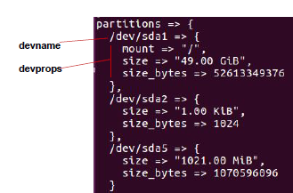
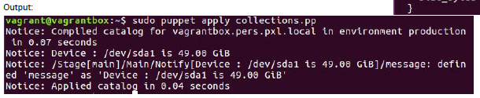

<center>
    
# Puppet

---
</center>

#### Table of contents:
1. [Wat is Puppet](#wat-is-puppet)
2. [Masterless - Puppet Apply](#masterless-puppet-apply)
3. [Puppet Resources](#puppet-resources)
4. [The big three](#the-big-three)
5. [Working with users](#working-with-users)
6. [Configureren van de host-file](#configureren-van-de-host-file)
7. [Een commando uitvoeren](#een-commando-uitvoeren)
8. [Werken met variabelen](#werken-met-variabelen)
9. [Instellen van Resource Defaults](#instellen-van-resource-defaults)
10. [Werken met facter](#werken-met-facter)
11. [Werken met condities](#werken-met-condities)
    11.1. [Werken met de selector (condition)](#werken-met-de-selector-condition)
    11.2. [Werken met case (condition)](#werken-met-case-condition)
12. [Werken met regular expressions](#werken-met-regular-expressions)
13. [Iteratie door fact-collecties](#iteratie-door-fact-collecties)
14. [Volgorde van de Resources](#volgorde-van-de-resources)
15. [Puppet Forge](#puppet-forge)
16. [Aanmaken van de PuppetServer en de PuppetNode](#aanmaken-van-de-puppetserver-en-de-puppetnode)
17. **[Oefeningen](#oefeningen)**

---

## Wat is Puppet:

**Puppet:** management software waarmee grote aantallen servers beheerd worden.
zoals:

* beheer van configuratie files
* beheer van geïnstalleerde software *(packages)*

*vb: het beheer van virtuele servers in een cloud. Het kan dan
gebruikt worden om bijvoorbeeld snel extra webservers te installeren.*

[**Puppet documentatie**](https://docs.puppetlabs.com/, "Puppet documentatie")

---

## Masterless - Puppet Apply:
*We maken een testserver om Puppet Apply te demonstreren*

```
vagrant init ubuntu/xenial64
    Noem de VM PuppetApply
Doe een provisioning van volgende items
    wget https://apt.puppetlabs.com/puppetlabs-release-pc1-xenial.deb
    dpkg -i puppetlabs-release-pc1-xenial.deb       # installeren van de nieuwe repository
    apt update
    apt install puppet-agent        # puppet-agent is de puppet uit de nieuwe repository
    echo 'PATH="$PATH:/opt/puppetlabs/puppet/bin"' >> /home/ubuntu/.profile
    sed -i s_:/sbin:_:/sbin:/opt/puppetlabs/puppet/bin:_ /etc/sudoers
    systemctl stop puppet.service; sudo systemctl disable puppet.service        #We stoppen en disablen de puppet-service
    systemctl status puppet.service
```
*In ubuntu zijn na installatie services automatisch enabled, in Centos niet!*

*Puppet werkt met manifests:*
* Een manifest geeft een bepaalde state weer waaraan voldaan moet worden
* Een manifest is een gewone tekstfile die eindigt op ``` pp ```

**Een 1ste voorbeeld van een manifest: **

```
vi helloworld.pp
notify { "Hello World":
}

puppet parser validate helloworld.pp
    => Niets terug = geen fouten

puppet apply helloworld.pp
```
*Kan ook zonder manifest-file met: puppet apply -e 'notify { "Hello World!" : }'*

*puppet resource user root → geeft de huidige instellingen*


**Regels uitfilteren op # en lege lijnen:**

```
grep -v '^\s*#\|^$' vagrantfile
```

**Als alias gebruiken in .bashrc:**

```
alias nocomment="grep -v '^\s*#\|^$\|^\s*$' vagrantfile"
en dan . ./.bash_profile
```

---
**User veranderen in puppet:**

```
puppet resource user ubuntu
```
**OUTPUT:**
```
user { 'ubuntu':
  ensure  => 'present',
  comment => 'Ubuntu',
  gid     => '1000',
  groups  => ['adm', 'dialout', 'cdrom', 'floppy', 'sudo', 'audio', 'dip', 'video', 'plugdev', 'n
etdev', 'lxd'],
  home    => '/home/ubuntu',
  shell   => '/bin/bash',
  uid     => '1000',
}
```

---
## Puppet Resources:

**Syntax van een resource:**

```
type { 'title' :
attribute => value,
}
```

**Alle resource types bekijken:**

```
puppet describe --list
```


**De syntax van een bepaald resource type bekijken:**

```
puppet describe <resource-type> [--short]
```

**Attributes die als kenmerk namevar hebben bij bepaalde resource types:**

> puppet describe <resource-type> | grep namevar

* Indien er bij een describe van een resource-type bij een bepaald attribute tussen haakjes namevar staat, dan kan je deze instelling onmiddellijk als titel gebruiken

```
puppet describe file | grep -A1 namevar
```
- path(namevar):
    - Het pad naar de file om te beheren moet het volledige pad zijn
---
```
vi motd.pp
file { 'Message File' :
    ensure  => 'file',
    content => 'Welcome to my server',
    path    => '/etc/motd',
}
```
is hetzelfde als:

```
file { '/etc/motd' :
    ensure  => 'file',
    content => 'Welcome to my server',
}
```

---
## The big three:
**Om services te installeren, maken we gebruik van 3 resource types:**
    * package
    * file
    * service

```
vi ntpd.pp
$ntp_conf = '#Managed by puppet 
server 3.be.pool.ntp.org iburst' 

package {ntp: }         #Een variable mag niet meermaals een waarde toegewezen krijgen!!
file {'/etc/ntp.conf':
    ensure  => file,
    content => $ntp_conf,       #zonder variabele: content => inline_template("#Managed by puppet...\n"),
    owner   => root,
    group   => root,         #wheel bij centos en 'root' bij ubuntu (is niet nodig, enkel hier als voorbeeld)
    mode    => '0664'
}
service {'NTP_Service':
    ensure => running,  #kan ook zijn: stopped, installed, absent, purged, latest, <versienummer>
    enable => true,
    name   => ntp         #ntpd bij centos en 'ntp' in ubuntu !!!
}
```

---
## Working with users:
**Indien we een user toevoegen, moeten we hem ook een paswoord geven:**
```
vi adduser.pp

group {'bob': }     #Zorgt er voor dat deze groep bestaat
user {'bob':
    ensure     => present,  # andere waarde is: absent
    managehome => true,
    gid        => 'bob',       #gid geeft de primaire groep aan
    groups     => [sudo,users],     #'sudo', in ubuntu (is niet nodig, enkel bij voorbeeld)
    password   => pw_hash('mijnpaswoord','SHA-512',salt),
}

sudo puppet parser validate adduser.pp
```
=> Indien niets terug = geen fouten

```
sudo puppet apply adduser.pp
```
*Indien de pw_hash niet gekend is, moeten we de standard library module nog installeren met:* **sudo puppet module install puppetlabs/stdlib**
---
## Configureren van de host-file:
**We kunnen ook name-resolving aanpassen via de hosts-file:**
```
vi confighost.pp

host {'webserver.sysnet.lan':
    ip           => '192.168.101.1',
    host_aliases => 'webserver'
}
```

```
sudo puppet parser validate confighost.pp
```
=> Indien niets terug = geen fouten

```
sudo puppet apply confighost.pp

ping webserver
ping webserver.sysnet.lan
```

---
## Een commando uitvoeren:
**Indien we een commando willen uitvoeren, maken we gebruik van de exec-resource:**
```
vi execute.pp

exec {'Updating Repositories':
    user    => 'root',
    group   => 'root',
    command => '/usr/bin/apt -y update',    #volledig pad moet opgegeven worden, of er moet gebruik
    path    => '/usr/bin/',    #gemaakt worden van de path-parameter (laatste slash moet niet)
}
```

```
sudo puppet parser validate execute.pp
```
=> Indien niets terug = geen fouten

```
sudo puppet apply execute.pp
```

---
## Werken met variabelen:
**Soms is het handiger of overzichtelijker om te werken met variabelen:**
```
$package2install = 'ntp'    
notify {"Ready to install ${package2install}-package": }    
    #variabelnamen moeten beginnen met $-teken en dan een kleine letter of
    #underscore. Ze mogen enkel kleine letters, nummers en underscores bevatten
    #Een variabele mag niet meermaals een waarde toegewezen krijgen!!
    #Indien achter de variabele onmiddellijk andere karakters volgen (en dus geen
    #spatie) dan moet de variabele omsloten worden met accolades
```

**Arrays als variabelen:**
```
$admingroups = ['wheel','adm', true, 123]   #Dit is een index-array
notify {"The first group is ${admingroups[0]}": } 
    #Hier moet de variabele ook omsloten worden met accolades, anders wordt
    #er geprint: The first group is [wheel,adm,true,123][0]
$user = { 'username' => 'bob', 'userid' => '2021' } 
notify {"The user’s name is ${user['username']}": } 
    #Dit is een hash-array
    #Hier moet de variabele ook omsloten worden met accolades, anders wordt
    #er geprint: {username => bob, userid => 2021}['username']
```

---

## Instellen van Resource Defaults:
**Indien we een Resource-naam laten beginnen met een hoofdletter, kunnen we default waarden toekennen:**
```
vi files.pp
File {                       #Let op de hoofdletter!
    owner  => 'root':        #default owner van een file is nu root
    group  => 'wheel',       #default group (bij ubuntu => 'sudo')
    mode   => '0664',        #default rechten van een file
    ensure => 'file',        #default is dan een file (en geen directory of link)
}

file { '/tmp/eennieuwedir/eerstefile': }    #file bevat nu onze default-file-waarden

file { '/tmp/eennieuwedir':
    ensure => 'directory',  #is nu een directory ipv een file
}

file { '/tmp/eennieuwedir/tweedefile':
    mode => '0775',         #rechten wijken af van de default '0664'
}
```

---

## Werken met facter:
**Facts zijn OS/hardware-kenmerken die op de agent worden verzameld, om naar de server te worden verstuurd, om daar een catalog te compileren. Op de client kunnen we deze facts ook opvragen met het commando facter:**

```
facter                    #geeft een volledige lijst
facter kernel             #geeft enkel de kernel-facts
facter os                 #lijst van facts ivm het OS
facter os.distro.codename #geeft codename xenial voor ubuntu 16.04
```

* In code kan dit worden opgevraagd via de **facts-array**:
```
vi facts.pp

$family = $facts[os][family] 
notify {"Het OS Family is: $family" :} 
```

---

## Werken met condities:
**Het krachtige is dat we facter en condities samen kunnen laten beslissen over situaties:**
```
vi conditions.pp

if $facts[os][family] == 'RedHat' {
    notify {'Het OS Family is RedHat' :}
}
elsif $facts[os][family] == 'Debian' {
    notify {'Het OS Family is Debian ':}
}
else {
    fail ("This OS, $facts[os][family], is not supported!") 
        #fail exits with this error-message
}
```

**Werken met not-equals of met unless:**
```
vi conditions.pp

if $facts[os][family] != 'RedHat' {
    notify {'Het OS Family is niet RedHat' :}
}
unless $facts[os][family] == 'RedHat' {
    notify {'Het OS Family is niet RedHat' :}
}
```

### Werken met de selector (condition):
**De selector is ook een verkorte vorm om condities te gebruiken:**
```
vi selector.pp

$ntp_service = $facts[os][family] ? {
    'RedHat' => 'ntpd',
    'Debian' => 'ntp',
}
package {'ntp': }
service {'NTP_Service':
    ensure => 'running',
    enable => true,
    name   => $ntp_service
}
...
```

### Werken met case (condition):
**We werken met case indien we meerde waarden telkens willen veranderen:**
```
vi case.pp

case $facts[os][family] {
    'RedHat': {                 # of redhat, centos {
        $ntp_service = 'ntpd'   # hier geen komma!
        $admingroup = 'wheel'
    }
    'Debian': {                 # of debian, ubuntu: {
        $ntp_service = 'ntp'
        $admingroup = 'sudo'
    }
    default: {
        fail ("Your ${facts['os']['family']} is not supported!")
    }
}
package {'ntp': }
file {'/etc/ntp.conf':
    ensure => 'file',
    group  => $admingroup,
…
}
service {'NTP_Service':
    ensure => 'running',
    enable => true,
    name   => $ntp_service
}
```

---

## Werken met regular expressions:
**Bij regular expressions omsluiten we de strings met forward-slashes in plaats van dubbele-quotes:**
```
vi regularexp.pp

if $facts['networking']['fqdn']=~ /^www\d/ {
    notify {'fqdn beginnend met www1, www2, www3, ...': }
}
elsif $facts['networking']['fqdn']=~ /\.sysnet\.lan$/ {
    notify {'fqdn eindigend op sysnet.lan': }
}
```

**Opgelet:** *een punt heeft een speciale betekenis en moet dus geëscaped worden met een back-slash*

---

## Iteratie door fact-collecties:
```
vi collections.pp

each ( $facts['partitions'] ) | $devname, $devprops | {
    if $devprops['mount'] {
        notify {"Device: ${devname} is ${devprops['size']}": }
    }
}
```



*Voor namen van de collections (devnames en devprops):* [doc puppet](https://docs.puppet.com/facter/3.4/core_facts.html "puppet docs facts")

---

## Volgorde van de Resources:
**Vanaf puppet 4 worden de resources uitgevoerd in de volgorde als ze voorkomen in het manifest.**

**We kunnen ook een volgorde opleggen:**
```
vi order.pp

package {'testpackage':
    before => File['testfile'], # Let op de hoofdletter !
}
file {'testfile':
    ...
    require => Package['testpackage'],  # Require niet meer nodig indien er een before naar wijst!
    before  => Service['testservice'],
    notify  => Service['testservice'], 
} 
    # Identiek aan before, maar zal de bij een wijziging aan de file service ook herstarten
service {'testservice':
    ...
    require   => File['testfile'],
    subscribe => File['testfile'],      # Identiek aan require, maar zal de service ook herstarten
}
```

---

# Puppet Forge:
**We kunnen modules downloaden van Puppet Forge, zodanig dat we het wiel niet opnieuw moeten uitvinden:**
    
* Surf naar [puppet forge](https://forge.puppet.com "Puppet Forge")
* Zoek naar een bepaalde module
* Module downloaden en installeren met:

```
sudo puppet module install <modulenaam>
```
* Module in standaardvorm uitvoeren met:
```
sudo puppet apply -e “include <modulenaam>”
```

* Slechts enkele dingen uitvoeren van de Module of standaardwaarden aanpassen:
    * In een manifest zouden we dan ook moeten toevoegen:
        * *include <modulenaam\>*
        * sudo puppet module install puppetlabs-apache
```
sudo vi apache.pp

class { 'apache':               # gebruik de "apache" module
    default_vhost => false,     # maak geen gebruik van de default vhost
    default_mods => false,      # default mods(cache,rewrite) niet inladen
    mpm_module => 'prefork',    # gebruik the "prefork" mpm_module
}
include apache::mod::php        # gebruik de “mod php” module
apache::vhost { 'example.com':  # maak een virtual host, genaamd "example.com"
port => '80',                   # die luistert op poort 80
docroot => '/var/www/html',     # en zijn document-root heeft in /var/www/html
}          
```

*De volledige documentatie van de puppetlabs-apache-module vind je op [puppet forge](https://forge.puppet.com "Puppet Forge") !!*

---

## Aanmaken van de PuppetServer en de PuppetNode:
*Zie de manifest files en de oefeningen*

---

---

# Oefeningen:
